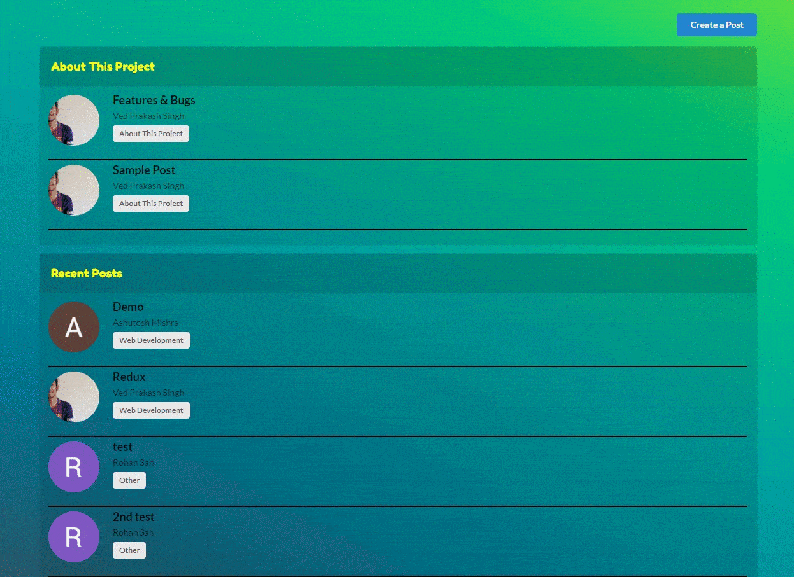
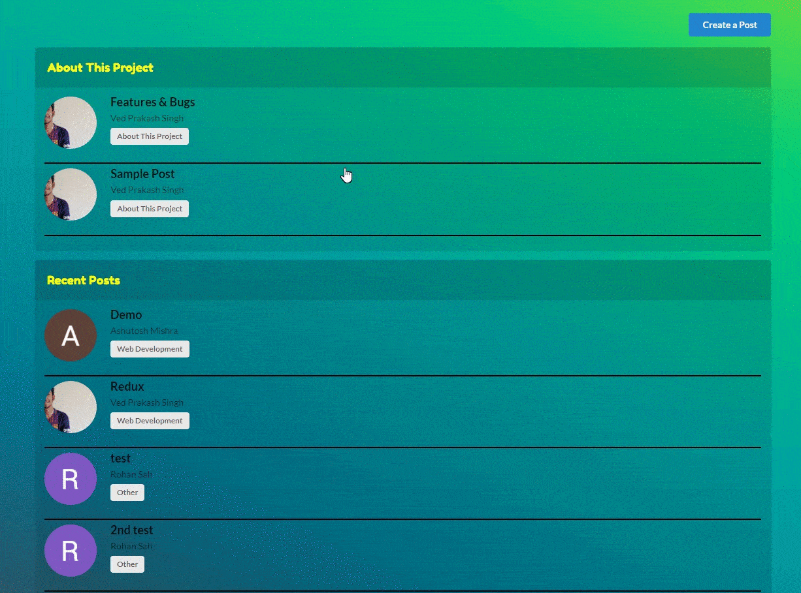

# TechTalk [(Live Demo)](https://narutovps-techtalk.herokuapp.com/)

> Online discussion forum built with React & Firestore.

## Table of Contents

-   [Features](#features)
-   [How To Use](#how-to-use)
-   [Contributing](#contributing)
-   [License](#license)

## Features

-   Create & Delete Posts
-   Reply to Posts & other users comments
-   User Profile
-   Super easy to use



## How To Use

> Make sure you have **node** installed in your system.
> Clone the repository, open terminal in the diretory and type the following command

```shell
$ npm install
$ npm run start
```

> Now open your broswer and go to the following address

```shell
http://localhost:3000/
```

---

## Contributing

> To contribute

### Step 1

-   🍴 Fork this repo!

### Step 2

-   ⛓ Create a new branch with meaningful name

## Step 3

-   **Do your Stuff!** 🔨🔨🔨

### Step 4

-   🔃 Create a new pull request

---

## License

[](http://badges.mit-license.org)

-   **[MIT license](http://opensource.org/licenses/mit-license.php)**
